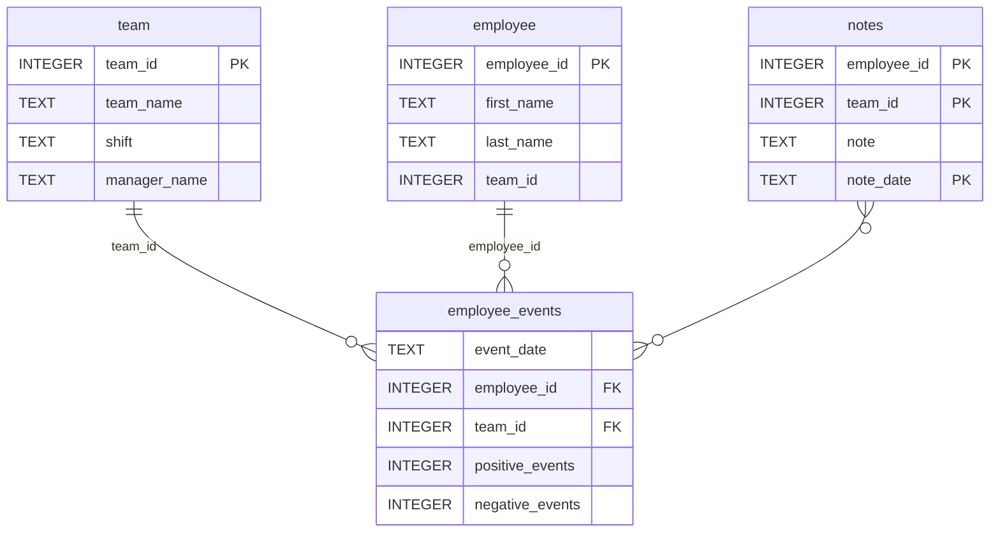

Project Overview
This project addresses a critical business challenge for manufacturing companies: retaining top talent. 

Installation Steps:

Creating New Environment and loading packages: 

 python -m venv new_env_01
 
source new_env_01/bin/activate

pip install -r requirements.txt

pip install -e ./python-package

Running the Dashboard:

python -m report.dashboard


# Software Engineering for Data Scientists 

This repository contains starter code for the **Software Engineering for Data Scientists** final project. Please reference your course materials for documentation on this repository's structure and important files. Happy coding!

### Repository Structure
```
├── README.md
├── assets
│   ├── model.pkl
│   └── report.css
├── env
├── python-package
│   ├── employee_events
│   │   ├── __init__.py
│   │   ├── employee.py
│   │   ├── employee_events.db
│   │   ├── query_base.py
│   │   ├── sql_execution.py
│   │   └── team.py
│   ├── requirements.txt
│   ├── setup.py
├── report
│   ├── base_components
│   │   ├── __init__.py
│   │   ├── base_component.py
│   │   ├── data_table.py
│   │   ├── dropdown.py
│   │   ├── matplotlib_viz.py
│   │   └── radio.py
│   ├── combined_components
│   │   ├── __init__.py
│   │   ├── combined_component.py
│   │   └── form_group.py
│   ├── dashboard.py
│   └── utils.py
├── requirements.txt
├── start
├── tests
    └── test_employee_events.py
```

### employee_events.db




Author

Suresh Kannan - Udacity Data Scientist Nanodegree Student

Acknowledgements

o	Udacity instructors for project guidance and curriculum development

o	Udacity reviewers for valuable feedback

o	FastHTML developers for the lightweight web framework

License

No additional licenses are needed from the author to use, modify, or distribute this software in accordance with the MIT License terms.
